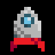

<h1>  Dodge the Space Rocks </h1>
A video game to keep this spinning rocket from crashing into evil space rocks. 

## Instructions
### Installation
Windows:
Run by downloading "dodge the space rocks.exe" and "dodge the space rocks.pck".
### Keyboard Controls
Movement: WASD/Arrow Keys
  Start: Enter/Space 

## Details
A 2D game developed in Godot Game Engine by following this tutorial from Godot Docs: https://docs.godotengine.org/en/stable/getting_started/first_2d_game/index.html.

### Changes from the tutorial:
- Overall theme
- Highscore system
- Scaling difficulty affected by time
- Varying pitch for background music affected by time.

## Assets
 Sprites and background made by me, using https://www.pixilart.com/.  
 Font and Music provided in the Godot Docs tutorial.
